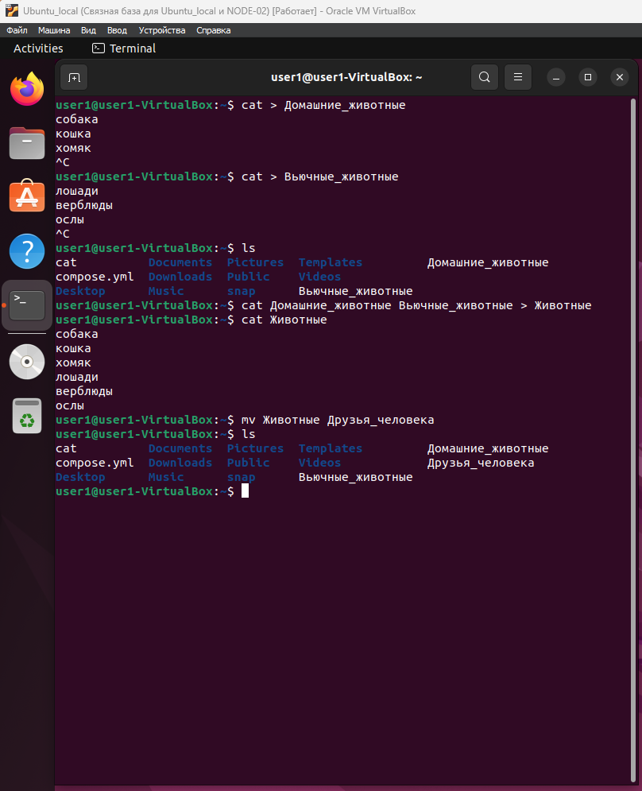
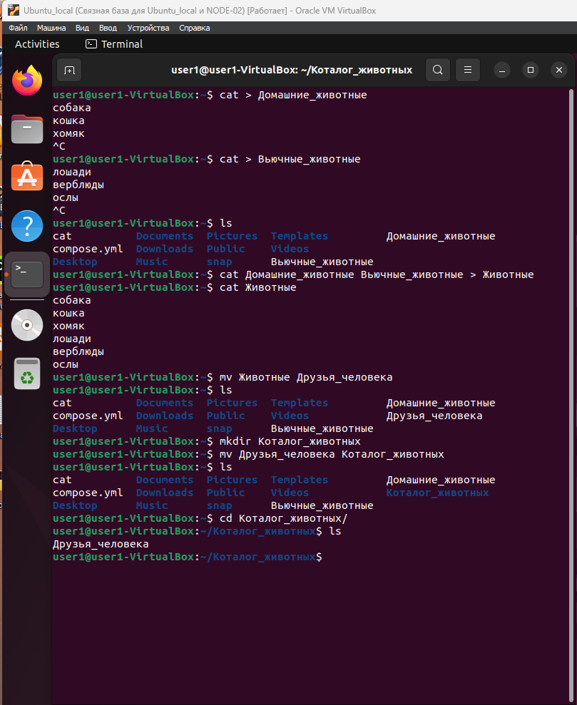
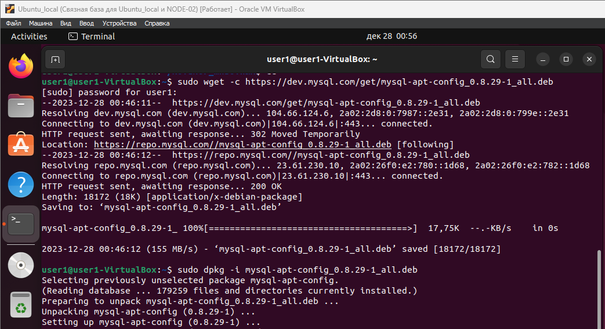
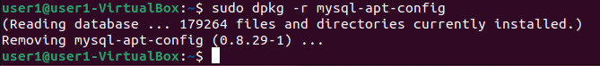
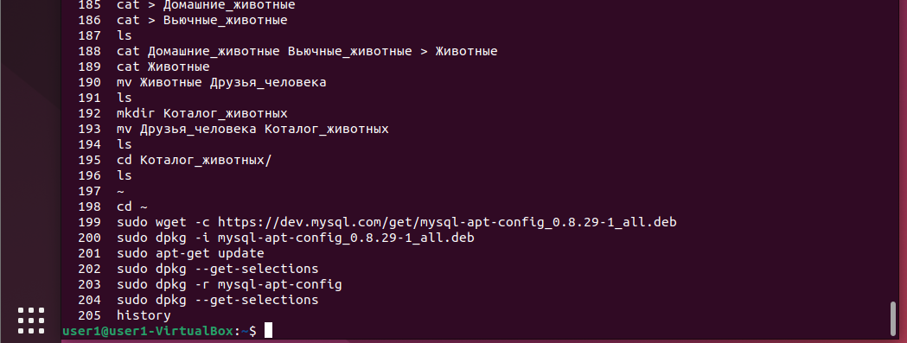
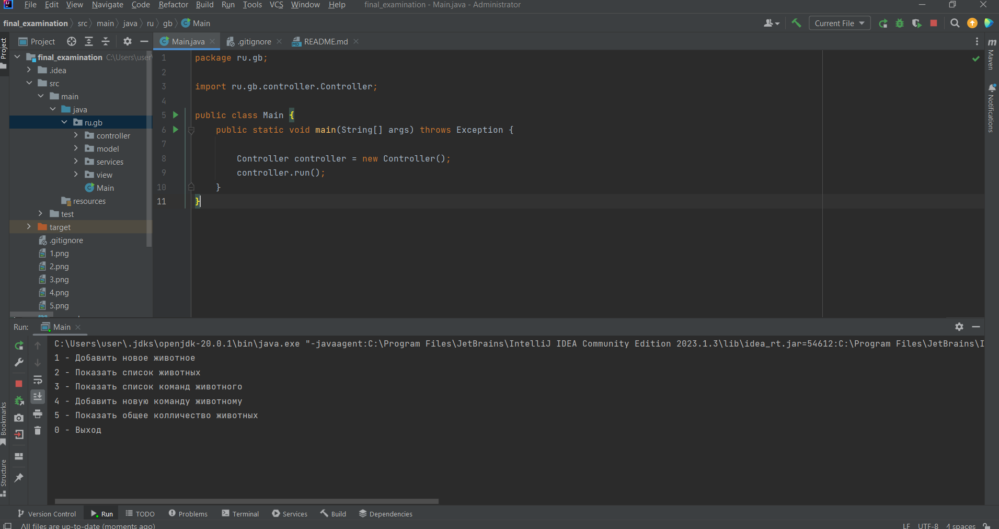

## Информация о проекте
Необходимо организовать систему учета для питомника в котором живут 
домашние и вьючные животные.

## Задание
1. Используя команду cat в терминале операционной системы Linux, создать
   два файла Домашние животные (заполнив файл собаками, кошками,
   хомяками) и Вьючные животными заполнив файл Лошадьми, верблюдами и
   ослы), а затем объединить их. Просмотреть содержимое созданного файла.
   Переименовать файл, дав ему новое имя (Друзья человека).

    

2. Создать директорию, переместить файл туда.

    

3. Подключить дополнительный репозиторий MySQL. Установить любой пакет
    из этого репозитория.

    

4. Установить и удалить deb-пакет с помощью dpkg.

    

5. Выложить [историю команд](ubuntu%20команды.txt) в терминале ubuntu

    

6. Нарисовать [диаграмму](Диаграмма%20классов.drawio), в которой есть класс родительский класс, домашние
   животные и вьючные животные, в составы которых в случае домашних
   животных войдут классы: собаки, кошки, хомяки, а в класс вьючные животные
   войдут: Лошади, верблюды и ослы).

    

7. В подключенном MySQL репозитории создать базу данных “Друзья
   человека”
    ```sql
    CREATE DATABASE human_friends;
    ```

8. Создать таблицы с иерархией из диаграммы в БД
    ```sql
   USE human_friends;

   CREATE TABLE animals (
       id INT NOT NULL AUTO_INCREMENT,
       class_name VARCHAR(20) NOT NULL,
       PRIMARY KEY (id));

   INSERT INTO animals (class_name)
   VALUES ('домашние'),
   ('вьючные');

   CREATE TABLE pets
   (
       id INT NOT NULL AUTO_INCREMENT,
       type_of_animal VARCHAR (20),
       id_class INT,
       PRIMARY KEY (id));

   INSERT INTO pets (type_of_animal, id_class)
   VALUES ('Собака', 1),
   ('Кошка', 1),  
   ('Хомяк', 1);

   CREATE TABLE pack_animals
   (
       id INT NOT NULL AUTO_INCREMENT,
       type_of_animal VARCHAR (20),
       id_class INT,
       PRIMARY KEY (id));

   INSERT INTO pack_animals (type_of_animal, id_class)
   VALUES ('Лошадь', 2),
   ('Верблюд', 2),
   ('Осёл', 2);
    ```
9. Заполнить низкоуровневые таблицы именами(животных), командами
    которые они выполняют и датами рождения
   ```sql
   CREATE TABLE dogs 
   (       
       id INT NOT NULL AUTO_INCREMENT, 
       name VARCHAR(20), 
       commands VARCHAR(50),
       birthday DATE,
       type_of_animal int,
       PRIMARY KEY (id));
    
   INSERT INTO dogs (name, commands, birthday, type_of_animal)
   VALUES ('Барбос', 'лапу, рядом', '2015-01-01', 1),
   ('Шарик', 'ко мне, лапу', '2021-01-02', 1),  
   ('Плюшка', 'ко мне, лапу, рядом', '2023-01-03', 1);

   CREATE TABLE cats 
   (       
       id INT NOT NULL AUTO_INCREMENT, 
       name VARCHAR(20), 
       commands VARCHAR(50),
       birthday DATE,
       type_of_animal int,
       PRIMARY KEY (id));

   INSERT INTO cats (name, commands, birthday, type_of_animal)
   VALUES ('Васька', 'кыс-кыс-кыс', '2021-02-01', 2),
   ('Матроскин', 'кушать', '2022-02-02', 2),  
   ('Мурка', 'кыс-кыс-кыс', '2023-02-03', 2); 

   CREATE TABLE hamsters 
   (       
       id INT NOT NULL AUTO_INCREMENT, 
       name VARCHAR(20), 
       commands VARCHAR(50),
       birthday DATE,
       type_of_animal int,
       PRIMARY KEY (id));
    
   INSERT INTO hamsters (name, commands, birthday, type_of_animal)
   VALUES ('Кругляш', NULL, '2023-03-01', 3),
   ('Миляш', NULL, '2023-03-02', 3),  
   ('Пухляш', NULL, '2023-03-03', 3);

   CREATE TABLE horses 
   (       
       id INT NOT NULL AUTO_INCREMENT, 
       name VARCHAR(20), 
       commands VARCHAR(50),
       birthday DATE,
       type_of_animal int,
       PRIMARY KEY (id));
    
   INSERT INTO horses (name, commands, birthday, type_of_animal)
   VALUES ('Апполон', 'рысью, шагом, тише', '2019-01-01', 1),
   ('Буран', 'рысью, хоп, тише', '2018-01-02', 1),  
   ('Бархат', 'рысью, шагом, хоп', '2022-01-03', 1);

   CREATE TABLE camels 
   (       
       id INT NOT NULL AUTO_INCREMENT, 
       name VARCHAR(20), 
       commands VARCHAR(50),
       birthday DATE,
       type_of_animal int,
       PRIMARY KEY (id));
    
   INSERT INTO camels (name, commands, birthday, type_of_animal)
   VALUES ('Улар', 'лево, право, стой, пошел', '2018-02-01', 2),
   ('Анчоус', NULL, '2020-02-02', 2),  
   ('Чиззи', NULL, '2022-02-03', 2);

   CREATE TABLE donkeys 
   (       
       id INT NOT NULL AUTO_INCREMENT, 
       name VARCHAR(20), 
       commands VARCHAR(50),
       birthday DATE,
       type_of_animal int,
       PRIMARY KEY (id));
    
   INSERT INTO donkeys (name, commands, birthday, type_of_animal)
   VALUES ('Дюна', NULL, '2019-03-01', 3),
   ('Руди', NULL, '2018-03-02', 3),  
   ('Торо', NULL, '2022-03-03', 3);
   ```

10. Удалив из таблицы верблюдов, т.к. верблюдов решили перевезти в другой
    питомник на зимовку. Объединить таблицы лошади, и ослы в одну таблицу.
   ```sql
   SET SQL_SAFE_UPDATES = 0;
   DELETE FROM camels;

   SELECT name, commands, birthday, type_of_animal 
   FROM horses
   UNION 
   SELECT  name, commands, birthday, type_of_animal 
   FROM donkeys;
   ```

11. Создать новую таблицу “молодые животные” в которую попадут все
    животные старше 1 года, но младше 3 лет и в отдельном столбце с точностью
    до месяца подсчитать возраст животных в новой таблице
   ```sql
   CREATE TEMPORARY TABLE t_animals AS 
   SELECT *, 'Собаки' as type  FROM dogs
   UNION SELECT *, 'Кошки' AS type FROM cats
   UNION SELECT *, 'Хомяки' AS type FROM hamsters
   UNION SELECT *, 'Лошади' AS type FROM horses
   UNION SELECT *, 'Ослы' AS type FROM donkeys;

   CREATE TABLE young_animals AS
   SELECT name, commands, birthday, type, TIMESTAMPDIFF(MONTH, birthday, CURDATE()) AS age_in_month
   FROM t_animals WHERE birthday BETWEEN ADDDATE(curdate(), INTERVAL -3 YEAR) AND ADDDATE(CURDATE(), INTERVAL -1 YEAR);
 
   SELECT * FROM young_animals;
   ```
12. Объединить все таблицы в одну, при этом сохраняя поля, указывающие на
    прошлую принадлежность к старым таблицам.
   ```sql
   SELECT horses.name, horses.birthday, horses.commands, pack_animals.type_of_animal, young_animals.age_in_month 
   FROM horses
   LEFT JOIN young_animals ON young_animals.name = horses.name
   LEFT JOIN pack_animals ON pack_animals.id = horses.type_of_animal
   UNION 
   SELECT donkeys.name, donkeys.birthday, donkeys.commands, pack_animals.type_of_animal, young_animals.age_in_month 
   FROM donkeys
   LEFT JOIN young_animals ON young_animals.name = donkeys.name
   LEFT JOIN pack_animals ON pack_animals.id = donkeys.type_of_animal
   UNION
   SELECT cats.name, cats.birthday, cats.commands, pets.type_of_animal, young_animals.age_in_month 
   FROM cats
   LEFT JOIN young_animals ON young_animals.name = cats.name
   LEFT JOIN pets ON pets.id = cats.type_of_animal
   UNION
   SELECT dogs.name, dogs.birthday, dogs.commands, pets.type_of_animal, young_animals.age_in_month 
   FROM dogs
   LEFT JOIN young_animals ON young_animals.name = dogs.name
   LEFT JOIN pets ON pets.id = dogs.type_of_animal
   UNION
   SELECT hamsters.name, hamsters.birthday, hamsters.commands, pets.type_of_animal, young_animals.age_in_month 
   FROM hamsters
   LEFT JOIN young_animals ON young_animals.name = hamsters.name
   LEFT JOIN pets ON pets.id = hamsters.type_of_animal;
   ```

13. Создать [класс](./src/main/java/ru/gb/model) с Инкапсуляцией методов и наследованием по диаграмме.
14. Написать [программу](./src/main/java/ru/gb), имитирующую работу реестра домашних животных.
    В программе должен быть реализован следующий функционал:
    14.1 Завести новое животное
    14.2 определять животное в правильный класс
    14.3 увидеть список команд, которое выполняет животное
    14.4 обучить животное новым командам
    14.5 Реализовать навигацию по меню
15. Создайте [класс Счетчик](./src/main/java/ru/gb/services/AnimalCounter.java), у которого есть метод add(), увеличивающий
    значение внутренней int переменной̆ на 1 при нажатии “Завести новое
    животное” Сделайте так, чтобы с объектом такого типа можно было работать в
    блоке try-with-resources. Нужно бросить исключение, если работа с объектом
    типа счетчик была не в ресурсном try и/или ресурс остался открыт. Значение
    считать в ресурсе try, если при заведении животного заполнены все поля.


